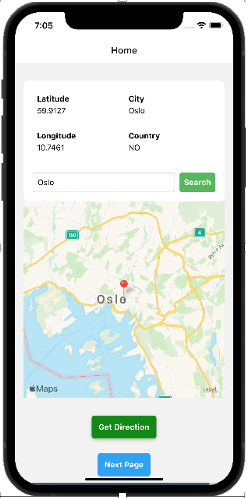

# Weather App
- This is a simple React Native weather app that allows users to view the current weather and a 7-day forecast based on their location or a searched city.

## Features
### Current Weather: 
- Displays information about the current temperature, feels-like temperature, wind speed, humidity, sunrise, sunset, description, and weather icon.

### 7-Day Forecast: 
- Provides a forecast for the next 7 days, including the date, temperature, and weather icon for each day.

### Location-based Weather: 
- Automatically fetches weather data based on the user's current location using the device's GPS.

### City Search: 
- Users can search for weather information by entering the name of a city.

### Get Direction: 
- Allows users to get directions to the current location using the device's maps app.

## Screenshots

### Home Screen

### Weather Screen

## Installation

### Clone the repository:
- git clone https://github.com/your-username/weather-app.git

### Navigate to the project directory:

- cd weather-app
### Install dependencies:
- npm install
### Run the application:
- npx react-native run-android
or

- npx react-native run-ios
### Dependencies
- React
- React Native
- React Navigation
- Expo Location
- React Native Maps
### API Key
- This app uses the OpenWeatherMap API to fetch weather data. You need to sign up to obtain an API key. Once you have the key, replace 'YOUR_API_KEY' with your actual API key in the following files:

- HomeScreen.js
- WeatherScreen.js
### Note
- This app is designed for educational purposes and may require further optimization for production use.
Feel free to explore, modify, and enhance the app! If you encounter any issues or have suggestions, please let us know.